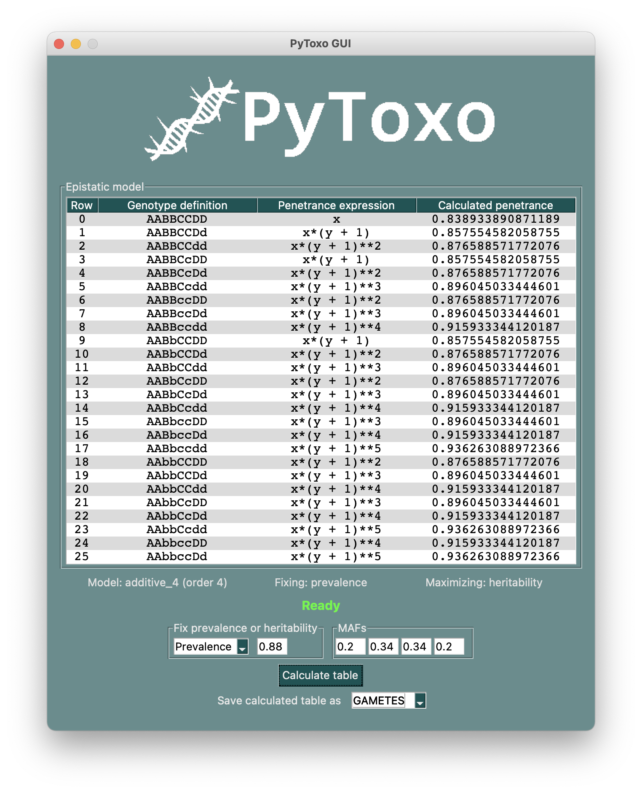

*A Python tool to calculate penetrance tables for high-order epistasis models.*

PyToxo is a library for calculating penetrance tables of any bivariate epistasis model, developed in Python. It is a improved version of the [Toxo](https://github.com/UDC-GAC/toxo) library.

PyToxo is an easy-to-use tool, which can be used directly as a Python library, or through a command-line interface (CLI) or a graphical user interface (GUI). It is aimed at professionals or people interested in the field of bioinformatics and especially genetics.

This work is part of Borja González Seoane's final project for his Degree in Computer Engineering studies from the University of A Coruña.




## Install

PyToxo requires **Python 3.8** or more modern to work. It is uploaded to the official Python [PyPI](https://pypi.org/project/pytoxo/) repository, so it is only needed to run the following command to install it:

```sh
pip install pytoxo
```


## Use

- To see how PyToxo is used as a library, you can examine this [example](examples/basic_use_of_pytoxo_as_library.ipynb).
- To see how PyToxo is used through its CLI, you can examine this [example](examples/basic_use_of_pytoxo_as_cli.sh). You can also revise the command-line help executing `pytoxo_cli -h`.
- To see how PyToxo is used through its GUI, you can examine the PyToxo manual. However, the GUI is very intuitive and guides the user step by step. You might want to venture out using the `pytoxo_gui` command to open the interface and take a look on your own.

In any case, I recommend you take a look at the PyToxo user manual. It is available in [English](manuals/manual_en.pdf) and [Spanish](manuals/manual_es.pdf).


## Run the tests

To run the tests you need to download this entire repository and install the development dependencies contained in manifest `requirements_dev.txt` with:

```sh
pip install -r requirements_dev.txt
```

PyToxo project uses the Python `unittest` to all its associated tests routines. PyToxo has unit, integration, solubility and accuracy level tests. All of them are stored into the `test` directory and respect the format `test_*.py`.

To run the tests, the easiest way is using the helper scripts `test/run_all_tests.py`, `test/run_all_tests_unit.py`, `test/run_all_tests_integration.py`, `test/run_all_tests_solubility.py` and `test/run_all_tests_accuracy.py`, to respectively run the appropriate tests. This script solve by their own the execution working directory, which must be the project home one.

It is also possible to run the tests since the command line. E.g.:

```sh
python -m unittest discover  # Runs all
python -m unittest discover test/unit  # Runs unit tests
python -m unittest discover test/integration  # Runs integration tests
# ...
```

The tests use material generated with Toxo to compare the two programs behaviour.


## Acknowledgements

Thanks to María José Martín Santamaría and Christian Ponte Fernández for their supervision of the project. Also thanks to Jorge González Domínguez.
